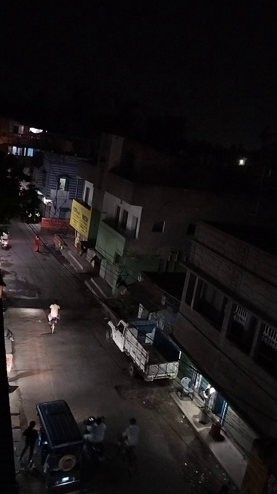
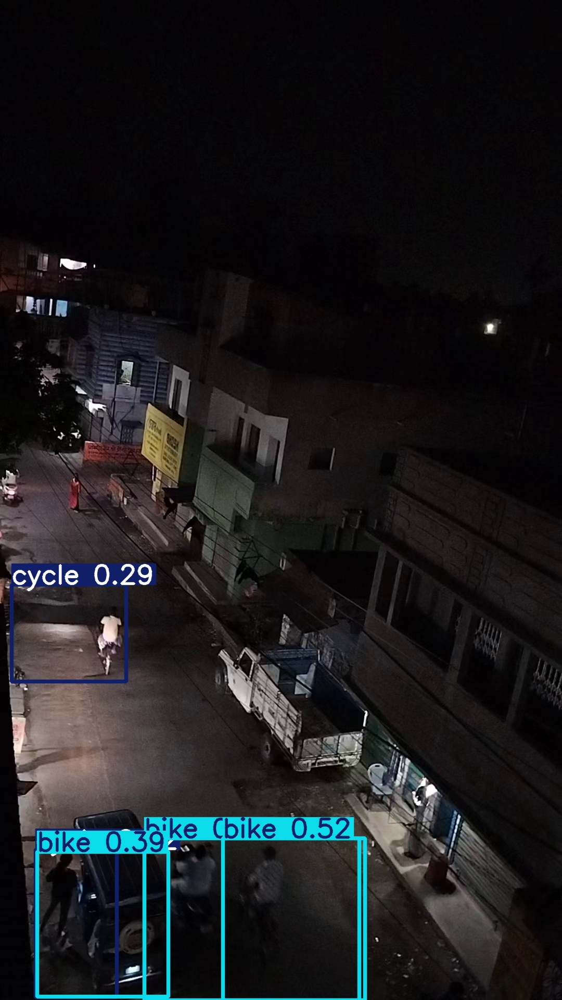
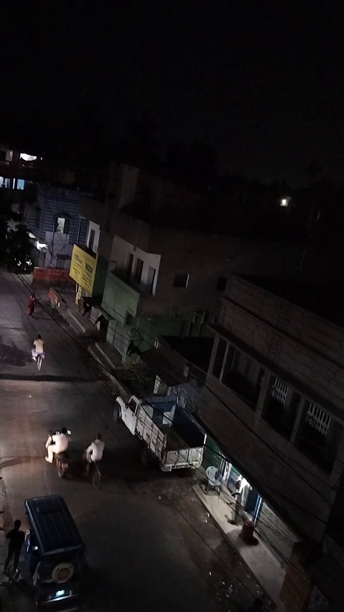
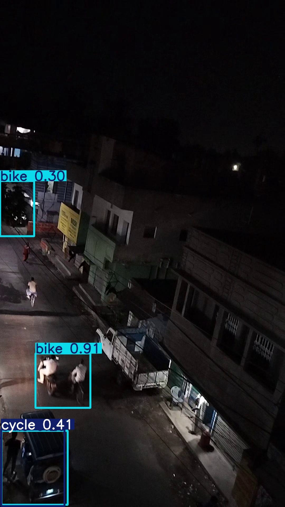
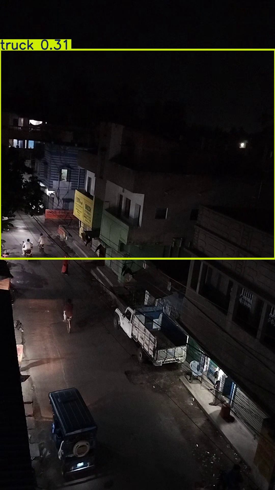
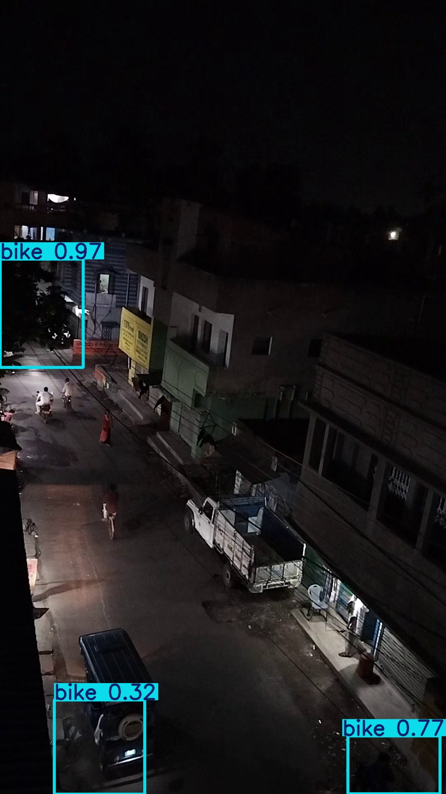

# vehicle-detection-domain-adaptation

Nighttime vehicle detection with hard negative mining and domain-focused error analysis.

> 基于 YOLO11s 的晴天夜间车辆检测实验：针对夜间灯光、屋顶、窗户反光引发的大框误检，引入无车辆 hard-negative 样本，并用 baseline 对比验证效果。

GitHub: [EdgarWyq/vehicle-detection-domain-adaptation](https://github.com/EdgarWyq/vehicle-detection-domain-adaptation)

## 项目亮点

- 发现真实业务问题：晴天夜间场景中，模型容易把建筑暗部、强光和反光区域误检为车辆。
- 设计对比实验：保持模型、输入尺寸、增强策略一致，只改变训练集是否加入 hard-negative 样本。
- 完成工程闭环：数据检查、负样本构造、baseline split、训练、验证、预测可视化、结果对比均脚本化。
- 实验结果可解释：hard-negative 不只减少大框误检，也让背景 objectness 降低，使真实小目标更容易保留下来。

## 实验结果

测试集为原始 `Sunny/Night` 验证集，共 50 张图片。两组实验均使用 `yolo11s.pt`、`imgsz=960`，并关闭图像增强。

| 实验 | 训练集 | Precision | Recall | mAP50 | mAP50-95 |
| --- | --- | ---: | ---: | ---: | ---: |
| Original baseline | 原始 Sunny/Night | 0.33581 | 0.17705 | 0.17374 | 0.08348 |
| Hard-negative | 原始 Sunny/Night + 60 张空标签硬负样本 | 0.40781 | 0.19583 | 0.20361 | 0.08817 |

## 可视化对比

下面三组是同一测试图在 baseline 与 hard-negative 模型上的预测差异。

| Case | Original baseline | Hard-negative |
| --- | --- | --- |
| test #26 |  |  |
| test #29 |  |  |
| test #46 |  |  |

## 为什么空标签样本有效

YOLO 在训练时不仅学习目标框，也会学习大量背景区域的 objectness。无车辆 hard-negative 图像会明确告诉模型：夜间灯光、屋顶轮廓、窗户反光和暗部纹理不是车辆。

这带来两个效果：

- 背景置信度下降，减少大框误检。
- 背景不再抢占高分候选框，NMS 后真实小目标更容易保留，因此部分漏检也会减少。

## 方法设计

```text
原始 Sunny/Night 数据
        |
        +-- baseline: 直接训练 yolo11s
        |
        +-- hard-negative: 加入 12 张无车辆夜间图像，每张复制 5 份
                         |
                         +-- 空标签 .txt
                         +-- 与 baseline 保持相同训练参数
```

关键设置：

- Model: `yolo11s.pt`
- Image size: `960`
- GPU: RTX 4060
- Augmentation: disabled
- Task focus: Sunny/Night vehicle detection

## 项目结构

```text
.
├── vehicle_yolo/
│   ├── config.py              # 路径、类别、训练参数、run 名称
│   ├── dataset.py             # YOLO 数据检查与 hard-negative 构造
│   ├── splits.py              # 生成不含 hard-negative 的 baseline split
│   ├── runner.py              # 训练、验证、预测封装
│   └── compare.py             # 读取 results.csv 并对比指标
├── add_negative_samples.py    # 生成 hard-negative 训练样本
├── prepare_original_split.py  # 生成 original baseline split
├── train_yolo.py              # hard-negative 实验训练入口
├── train_yolo_original.py     # original baseline 训练入口
├── predict_compare.py         # 两个模型在同一测试集上导出可视化
├── compare_experiments.py     # 指标对比入口
├── local.example.yaml         # 数据配置模板
├── docs/
│   ├── EXPERIMENTS.md
│   └── assets/
└── reports/
    └── compare_sunny_night.md
```

## 复现方式

克隆项目：

```powershell
git clone https://github.com/EdgarWyq/vehicle-detection-domain-adaptation.git
cd vehicle-detection-domain-adaptation
```

1. 安装依赖：

```powershell
.\.venv\Scripts\python.exe -m pip install -r requirements.txt
```

2. 准备数据：

将 ICDEC 数据集放到本地，并参考 `local.example.yaml` 创建 `local.yaml`。期望目录结构：

```text
ICDEC_challenge_2024-main/
  images/Train/Sunny/Night
  images/Val/Sunny/Night
  labels/Train/Sunny/Night
  labels/Val/Sunny/Night
```

3. 检查数据：

```powershell
.\.venv\Scripts\python.exe check_dataset.py
```

4. 训练 hard-negative 实验：

```powershell
.\.venv\Scripts\python.exe add_negative_samples.py
.\.venv\Scripts\python.exe train_yolo.py
```

5. 训练 original baseline：

```powershell
.\.venv\Scripts\python.exe prepare_original_split.py
.\.venv\Scripts\python.exe train_yolo_original.py
```

6. 对比结果并导出可视化：

```powershell
.\.venv\Scripts\python.exe compare_experiments.py
.\.venv\Scripts\python.exe predict_compare.py
```

## 说明

本仓库不包含完整数据集、训练权重和 `runs/` 输出目录。`docs/assets/` 中仅保留少量可视化图片用于展示实验现象。

更多材料：

- [完整实验报告](docs/EXPERIMENTS.md)
- [简历与面试表达](docs/PORTFOLIO.md)
- [本次指标对比摘要](reports/compare_sunny_night.md)
